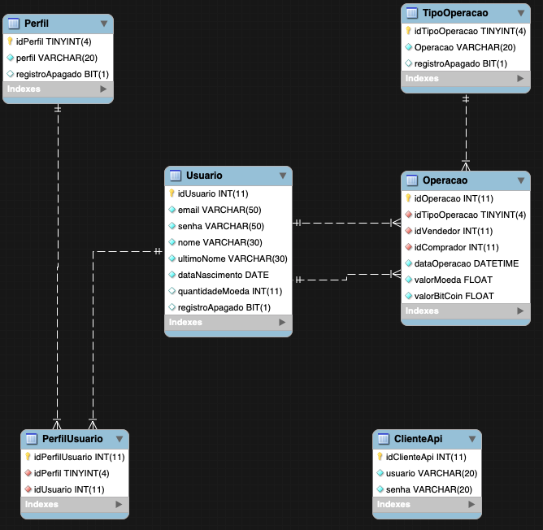

# RedCoinApi
O repositório RedCoinApi contém as operações para viabilizar as transações de compra e venda de bitcoins.
<h2>Sobre o desenvolvimento do projeto</h2>

A versão inicial da RedCoinApi conta com as seguintes entidades para satisfazer as operações de Compra e venda de bitcoins: 
    <ul>
        <li>
            ClienteApi - Representa os clientes que tem acesso aos métodos da API.
        </li>
        <li>
            Usuario - Representa os usuários que realizam a operação de compra e venda de bitcoins.
        </li>
        <li>PerfilUsuario - Representa a categoria do Usuario, se ele é vendedor, comprador ou ambos.</li>
        <li>
            Operacao - Representa as movimentações de compra e venda dos bitcoins.
        </li>
        <li>
            TipoOperacao - Representa o tipo da movimentação que o Usuario está realizando.
        </li>
    </ul>
    

<h2>Utilização do Redis</h2>
A fim de Otimizar o desempenho das operações de compra e venda de BitCoin, é utilizado o banco de dados Redis, para gravar em cache-server a cotação dos Bitcoins. 
Como funciona: 
<ol>
    <li>A regra para a precificação dos Bitcoins, é que seja atualizada a cotação de preço de 1 em 1 hora;</li>
    <li>Dessa forma, a "primeira" consulta da cotação de preço de bitcoins é armazenada no Redis, com o prazo de expiração de 50 minutos;</li>
    <li>Enquanto o valor estiver válido no cache do Redis, as operações não realizam a consulta da API para precificação de Bitcoin.</li>
</ol>
<h2>Instalando a RedCoinApi</h2>

Para o funcionamento da RedCoinApi serão necessários os seguintes requisitos:
<ul>
    <li>Docker - 19.03</li>
    <li>Docker-Compose - 19.03</li>
    <li>golang - 13.5</li>
    <li>MySql Workbench ou similar (para rodar o script de migration)</li>
</ul>

Portas utilizadas

<ul>
    <li>MySql - 1805</li>
    <li>Redis - 6372</li>
    <li>RedCoinApi - 2801</li>
</ul>

Siga os seguintes passos:

<ol>
    <li>
        Clone o repositório <a href="http://www.github.com/rteles86/RedCoinApi" target="_blank">RedCoinApi</a>
    </li>
    <li>
        Abra o terminal de comando de seu sistema operacional. Ex: MS-DOS (Windows) ou TERMINAL - MacOS
    </li>
    <li>
        Navegue até o diretório do repositório RedCoinApi "./Instalacao/docker-compose" 
        &nbsp;&nbsp;&nbsp;- Execute o seguinte comando: <b>docker-compose up -d</b>
    </li>
    <li>
        Navegue até o diretório do repositório RedCoinApi "./API" 
        &nbsp;&nbsp;&nbsp;- Execute o seguinte comando: <b>docker build -t redcoin .</b>
    </li>
    <li>
        Execute a imagem da RedCoinApi 
        &nbsp;&nbsp;&nbsp;- Execute o seguinte comando: <b>docker run -d -p 2801:2801 --name apiredcoin redcoin</b>
    </li>
    <li>
        Execute o arquivo de migration 
        &nbsp;&nbsp;&nbsp;Navegue até o diretório "./Instalacao/migration" 
        &nbsp;&nbsp;&nbsp;Execute o script na instância do MySql criada após a execução do "docker-compose/mysql" 
    </li>
</ol>
<h2>
    Exemplo de consumo dos Endpoints RedCoinApi
</h2>

Após a instalação da RedCoinApi, recomendo a utilização da ferramenta Postman, para realizar os testes e consumo dos Endpoints.

<h3>Adicionar Cliente Api</h3>

    &nbsp;&nbsp;&nbsp;&nbsp;&nbsp;&nbsp;Descrição: Realiza o cadastro de um novo cliente da RedCoinApi 
    &nbsp;&nbsp;&nbsp;&nbsp;&nbsp;&nbsp;URL: http://localhost:2801/autenticacao/adicionar 
    &nbsp;&nbsp;&nbsp;&nbsp;&nbsp;&nbsp;Tipo: POST 
    &nbsp;&nbsp;&nbsp;&nbsp;&nbsp;&nbsp;Parâmetros Body: 
     &nbsp;&nbsp;&nbsp;&nbsp;&nbsp;&nbsp;{
     &nbsp;&nbsp;&nbsp;&nbsp;&nbsp;&nbsp;&nbsp;&nbsp;&nbsp;"usuario":"redcoinApi"
     &nbsp;&nbsp;&nbsp;&nbsp;&nbsp;&nbsp;&nbsp;&nbsp;&nbsp;,"senha":"redcoinApi@@"
     &nbsp;&nbsp;&nbsp;&nbsp;&nbsp;&nbsp;}

<h3>Autenticar Cliente Api</h3>

    &nbsp;&nbsp;&nbsp;&nbsp;&nbsp;&nbsp;Descrição: Verifica se as credenciais do cliente da RedCoinApi são válidas 
    &nbsp;&nbsp;&nbsp;&nbsp;&nbsp;&nbsp;URL: http://localhost:2801/autenticacao 
    &nbsp;&nbsp;&nbsp;&nbsp;&nbsp;&nbsp;Tipo: POST 
    &nbsp;&nbsp;&nbsp;&nbsp;&nbsp;&nbsp;Parâmetros Body: 
     &nbsp;&nbsp;&nbsp;&nbsp;&nbsp;&nbsp;{
         &nbsp;&nbsp;&nbsp;&nbsp;&nbsp;&nbsp;&nbsp;&nbsp;&nbsp;"usuario":"redcoinApi"
         &nbsp;&nbsp;&nbsp;&nbsp;&nbsp;&nbsp;&nbsp;&nbsp;&nbsp;,"senha":"redcoinApi@@"
     &nbsp;&nbsp;&nbsp;&nbsp;&nbsp;&nbsp;}

<h3>Listar Todos Perfil</h3>

    &nbsp;&nbsp;&nbsp;&nbsp;&nbsp;&nbsp;Descrição: Lista de todos os Perfil cadastrados 
    &nbsp;&nbsp;&nbsp;&nbsp;&nbsp;&nbsp;URL: http://localhost:2801/api/perfil/todos 
    &nbsp;&nbsp;&nbsp;&nbsp;&nbsp;&nbsp;Tipo: GET

<h3>Perfil Id</h3>

    &nbsp;&nbsp;&nbsp;&nbsp;&nbsp;&nbsp;Descrição: Retorna o Perfil cadastrado de acordo com o ID 
    &nbsp;&nbsp;&nbsp;&nbsp;&nbsp;&nbsp;URL: http://localhost:2801/api/perfil/id 
    &nbsp;&nbsp;&nbsp;&nbsp;&nbsp;&nbsp;Tipo: GET 
    &nbsp;&nbsp;&nbsp;&nbsp;&nbsp;&nbsp;Parâmetros: ?id=1

<h3>Perfil Adicionar</h3>

    &nbsp;&nbsp;&nbsp;&nbsp;&nbsp;&nbsp;Descrição: Realiza o cadastro de um novo Perfil 
    &nbsp;&nbsp;&nbsp;&nbsp;&nbsp;&nbsp;URL: http://localhost:2801/api/perfil/adicionar 
    &nbsp;&nbsp;&nbsp;&nbsp;&nbsp;&nbsp;Tipo: POST 
    &nbsp;&nbsp;&nbsp;&nbsp;&nbsp;&nbsp;Parâmetros Body: 
     &nbsp;&nbsp;&nbsp;&nbsp;&nbsp;&nbsp;{
     &nbsp;&nbsp;&nbsp;&nbsp;&nbsp;&nbsp;&nbsp;&nbsp;&nbsp;"perfil":"Comprador"
     &nbsp;&nbsp;&nbsp;&nbsp;&nbsp;&nbsp;}

<h3>Perfil Alterar</h3>

    &nbsp;&nbsp;&nbsp;&nbsp;&nbsp;&nbsp;Descrição: Altera o registro de um Perfil 
    &nbsp;&nbsp;&nbsp;&nbsp;&nbsp;&nbsp;URL: http://localhost:2801/api/perfil/alterar 
    &nbsp;&nbsp;&nbsp;&nbsp;&nbsp;&nbsp;Tipo: PUT 
    &nbsp;&nbsp;&nbsp;&nbsp;&nbsp;&nbsp;Parâmetros Body: 
     &nbsp;&nbsp;&nbsp;&nbsp;&nbsp;&nbsp;{
         &nbsp;&nbsp;&nbsp;&nbsp;&nbsp;&nbsp;&nbsp;&nbsp;&nbsp;"id":1
         &nbsp;&nbsp;&nbsp;&nbsp;&nbsp;&nbsp;&nbsp;&nbsp;&nbsp;,"perfil":"Corretor"
     &nbsp;&nbsp;&nbsp;&nbsp;&nbsp;&nbsp;}

<h3>Listar Todos TipoOperacao</h3>

    &nbsp;&nbsp;&nbsp;&nbsp;&nbsp;&nbsp;Descrição: Lista de todos os TipoOperacao cadastrados 
    &nbsp;&nbsp;&nbsp;&nbsp;&nbsp;&nbsp;URL: http://localhost:2801/api/tipo-operacao/todos 
    &nbsp;&nbsp;&nbsp;&nbsp;&nbsp;&nbsp;Tipo: GET

<h3>TipoOperacao Id</h3>

    &nbsp;&nbsp;&nbsp;&nbsp;&nbsp;&nbsp;Descrição: Retorna o TipoOperacao cadastrado de acordo com o ID 
    &nbsp;&nbsp;&nbsp;&nbsp;&nbsp;&nbsp;URL: http://localhost:2801/api/tipo-operacao/id 
    &nbsp;&nbsp;&nbsp;&nbsp;&nbsp;&nbsp;Tipo: GET 
    &nbsp;&nbsp;&nbsp;&nbsp;&nbsp;&nbsp;Parâmetros: ?id=1

<h3>TipoOperacao Adicionar</h3>

    &nbsp;&nbsp;&nbsp;&nbsp;&nbsp;&nbsp;Descrição: Realiza o cadastro de um novo TipoOperacao 
    &nbsp;&nbsp;&nbsp;&nbsp;&nbsp;&nbsp;URL: http://localhost:2801/api/tipo-operacao/adicionar 
    &nbsp;&nbsp;&nbsp;&nbsp;&nbsp;&nbsp;Tipo: POST 
    &nbsp;&nbsp;&nbsp;&nbsp;&nbsp;&nbsp;Parâmetros Body: 
     &nbsp;&nbsp;&nbsp;&nbsp;&nbsp;&nbsp;{
     &nbsp;&nbsp;&nbsp;&nbsp;&nbsp;&nbsp;&nbsp;&nbsp;&nbsp;"operacao":"Venda"
     &nbsp;&nbsp;&nbsp;&nbsp;&nbsp;&nbsp;}

<h3>TipoOperacao Alterar</h3>

    &nbsp;&nbsp;&nbsp;&nbsp;&nbsp;&nbsp;Descrição: Altera o registro de um TipoOperacao 
    &nbsp;&nbsp;&nbsp;&nbsp;&nbsp;&nbsp;URL: http://localhost:2801/api/tipo-operacao/alterar 
    &nbsp;&nbsp;&nbsp;&nbsp;&nbsp;&nbsp;Tipo: PUT 
    &nbsp;&nbsp;&nbsp;&nbsp;&nbsp;&nbsp;Parâmetros Body: 
     &nbsp;&nbsp;&nbsp;&nbsp;&nbsp;&nbsp;{
     &nbsp;&nbsp;&nbsp;&nbsp;&nbsp;&nbsp;&nbsp;&nbsp;&nbsp;"id":1
     &nbsp;&nbsp;&nbsp;&nbsp;&nbsp;&nbsp;&nbsp;&nbsp;&nbsp;,"operacao":"Compra"
     &nbsp;&nbsp;&nbsp;&nbsp;&nbsp;&nbsp;}

<h3>Listar Todos Usuario</h3>

    &nbsp;&nbsp;&nbsp;&nbsp;&nbsp;&nbsp;Descrição: Lista de todos os Usuario cadastrados 
    &nbsp;&nbsp;&nbsp;&nbsp;&nbsp;&nbsp;URL: http://localhost:2801/api/usuario/todos 
    &nbsp;&nbsp;&nbsp;&nbsp;&nbsp;&nbsp;Tipo: GET

<h3>Usuario Id</h3>

    &nbsp;&nbsp;&nbsp;&nbsp;&nbsp;&nbsp;Descrição: Retorna o Usuario cadastrado de acordo com o ID 
    &nbsp;&nbsp;&nbsp;&nbsp;&nbsp;&nbsp;URL: http://localhost:2801/api/usuario/id?id={valor} 
    &nbsp;&nbsp;&nbsp;&nbsp;&nbsp;&nbsp;Tipo: GET 
    &nbsp;&nbsp;&nbsp;&nbsp;&nbsp;&nbsp;Parâmetros: ?id=1

<h3>Usuario Adicionar</h3>

    &nbsp;&nbsp;&nbsp;&nbsp;&nbsp;&nbsp;Descrição: Realiza o cadastro de um novo Usuario 
    &nbsp;&nbsp;&nbsp;&nbsp;&nbsp;&nbsp;URL: http://localhost:2801/api/usuario/adicionar 
    &nbsp;&nbsp;&nbsp;&nbsp;&nbsp;&nbsp;Tipo: POST 
    &nbsp;&nbsp;&nbsp;&nbsp;&nbsp;&nbsp;Parâmetros Body: 
     &nbsp;&nbsp;&nbsp;&nbsp;&nbsp;&nbsp;{
         &nbsp;&nbsp;&nbsp;&nbsp;&nbsp;&nbsp;&nbsp;&nbsp;&nbsp;"email": "redcoinapi@redcoinapi.com",
         &nbsp;&nbsp;&nbsp;&nbsp;&nbsp;&nbsp;&nbsp;&nbsp;&nbsp;"senha": "123Mudar",
         &nbsp;&nbsp;&nbsp;&nbsp;&nbsp;&nbsp;&nbsp;&nbsp;&nbsp;"nome": "Red Coin",
         &nbsp;&nbsp;&nbsp;&nbsp;&nbsp;&nbsp;&nbsp;&nbsp;&nbsp;"ultimoNome": "Api",
         &nbsp;&nbsp;&nbsp;&nbsp;&nbsp;&nbsp;&nbsp;&nbsp;&nbsp;"nascimento": "2019-12-22T00:00:00Z",
         &nbsp;&nbsp;&nbsp;&nbsp;&nbsp;&nbsp;&nbsp;&nbsp;&nbsp;"quantidadeMoeda": 0,
         &nbsp;&nbsp;&nbsp;&nbsp;&nbsp;&nbsp;&nbsp;&nbsp;&nbsp;"perfil": [
         &nbsp;&nbsp;&nbsp;&nbsp;&nbsp;&nbsp;&nbsp;&nbsp;&nbsp;&nbsp;&nbsp;&nbsp;{
             &nbsp;&nbsp;&nbsp;&nbsp;&nbsp;&nbsp;&nbsp;&nbsp;&nbsp;&nbsp;&nbsp;&nbsp;"id": 1,
             &nbsp;&nbsp;&nbsp;&nbsp;&nbsp;&nbsp;&nbsp;&nbsp;&nbsp;&nbsp;&nbsp;&nbsp;"perfil": "Comprador"
             &nbsp;&nbsp;&nbsp;&nbsp;&nbsp;&nbsp;&nbsp;&nbsp;&nbsp;&nbsp;&nbsp;&nbsp;}
             &nbsp;&nbsp;&nbsp;&nbsp;&nbsp;&nbsp;&nbsp;&nbsp;&nbsp;]
     &nbsp;&nbsp;&nbsp;&nbsp;&nbsp;&nbsp;&nbsp;&nbsp;&nbsp;}

<h3>Usuario Alterar</h3>

    &nbsp;&nbsp;&nbsp;&nbsp;&nbsp;&nbsp;Descrição: Altera o registro de um Usuario 
    &nbsp;&nbsp;&nbsp;&nbsp;&nbsp;&nbsp;URL: http://localhost:2801/api/usuario/alterar 
    &nbsp;&nbsp;&nbsp;&nbsp;&nbsp;&nbsp;Tipo: PUT 
    &nbsp;&nbsp;&nbsp;&nbsp;&nbsp;&nbsp;Parâmetros Body: 
     &nbsp;&nbsp;&nbsp;&nbsp;&nbsp;&nbsp;{
         &nbsp;&nbsp;&nbsp;&nbsp;&nbsp;&nbsp;&nbsp;&nbsp;&nbsp;"id": 1,
         &nbsp;&nbsp;&nbsp;&nbsp;&nbsp;&nbsp;&nbsp;&nbsp;&nbsp;"email": "redcoinapi@redcoinapi.com",
         &nbsp;&nbsp;&nbsp;&nbsp;&nbsp;&nbsp;&nbsp;&nbsp;&nbsp;"senha": "123Mudar",
         &nbsp;&nbsp;&nbsp;&nbsp;&nbsp;&nbsp;&nbsp;&nbsp;&nbsp;"nome": "Red Coin",
         &nbsp;&nbsp;&nbsp;&nbsp;&nbsp;&nbsp;&nbsp;&nbsp;&nbsp;"ultimoNome": "Api",
         &nbsp;&nbsp;&nbsp;&nbsp;&nbsp;&nbsp;&nbsp;&nbsp;&nbsp;"nascimento": "2019-12-22T00:00:00Z",
         &nbsp;&nbsp;&nbsp;&nbsp;&nbsp;&nbsp;&nbsp;&nbsp;&nbsp;"quantidadeMoeda": 0,
         &nbsp;&nbsp;&nbsp;&nbsp;&nbsp;&nbsp;&nbsp;&nbsp;&nbsp;"perfil": [
         &nbsp;&nbsp;&nbsp;&nbsp;&nbsp;&nbsp;&nbsp;&nbsp;&nbsp;&nbsp;&nbsp;&nbsp;{
             &nbsp;&nbsp;&nbsp;&nbsp;&nbsp;&nbsp;&nbsp;&nbsp;&nbsp;&nbsp;&nbsp;&nbsp;"id": 2,
             &nbsp;&nbsp;&nbsp;&nbsp;&nbsp;&nbsp;&nbsp;&nbsp;&nbsp;&nbsp;&nbsp;&nbsp;"perfil": "Vendedor"
             &nbsp;&nbsp;&nbsp;&nbsp;&nbsp;&nbsp;&nbsp;&nbsp;&nbsp;&nbsp;&nbsp;&nbsp;}
             &nbsp;&nbsp;&nbsp;&nbsp;&nbsp;&nbsp;&nbsp;&nbsp;&nbsp;]
     &nbsp;&nbsp;&nbsp;&nbsp;&nbsp;&nbsp;&nbsp;&nbsp;&nbsp;}

<h3>Operacao Email</h3>

    &nbsp;&nbsp;&nbsp;&nbsp;&nbsp;&nbsp;Descrição: Lista todas as transações de um Usuario a partir de seu Email 
    &nbsp;&nbsp;&nbsp;&nbsp;&nbsp;&nbsp;URL: http://localhost:2801/api/operacao/email?email={valor} 
    &nbsp;&nbsp;&nbsp;&nbsp;&nbsp;&nbsp;Tipo: GET 
    &nbsp;&nbsp;&nbsp;&nbsp;&nbsp;&nbsp;Parâmetros: ?email=redcoinapi@redcoinapi.com

<h3>Operacao Data</h3>

    &nbsp;&nbsp;&nbsp;&nbsp;&nbsp;&nbsp;Descrição: Lista todas as transações registradas em uma determinada data 
    &nbsp;&nbsp;&nbsp;&nbsp;&nbsp;&nbsp;URL: http://localhost:2801/api/operacao/data?data={valor} 
    &nbsp;&nbsp;&nbsp;&nbsp;&nbsp;&nbsp;Tipo: GET 
    &nbsp;&nbsp;&nbsp;&nbsp;&nbsp;&nbsp;Parâmetros: ?data=2019-12-22

<h3>Operacao Gravar</h3>

    &nbsp;&nbsp;&nbsp;&nbsp;&nbsp;&nbsp;Descrição: Retorna o Perfil cadastrado de acordo com o ID 
    &nbsp;&nbsp;&nbsp;&nbsp;&nbsp;&nbsp;URL: http://localhost:2801/api/operacao/gravar 
    &nbsp;&nbsp;&nbsp;&nbsp;&nbsp;&nbsp;Tipo: POST 
    &nbsp;&nbsp;&nbsp;&nbsp;&nbsp;&nbsp;Parâmetros body: 
    &nbsp;&nbsp;&nbsp;&nbsp;&nbsp;&nbsp;{ 
        &nbsp;&nbsp;&nbsp;&nbsp;&nbsp;&nbsp;&nbsp;&nbsp;&nbsp;"idTipo": 1, 
        &nbsp;&nbsp;&nbsp;&nbsp;&nbsp;&nbsp;&nbsp;&nbsp;&nbsp;"idVendedor": 2, 
        &nbsp;&nbsp;&nbsp;&nbsp;&nbsp;&nbsp;&nbsp;&nbsp;&nbsp;"idComprador": 2{ 
        &nbsp;&nbsp;&nbsp;&nbsp;&nbsp;&nbsp;&nbsp;&nbsp;&nbsp;"DataOperacao": "2019-12-22T01:56:32Z", 
        &nbsp;&nbsp;&nbsp;&nbsp;&nbsp;&nbsp;&nbsp;&nbsp;&nbsp;"ValorMoeda": 14717.366, 
        &nbsp;&nbsp;&nbsp;&nbsp;&nbsp;&nbsp;&nbsp;&nbsp;&nbsp;"ValorBitCoin": 0.10 
            &nbsp;&nbsp;&nbsp;&nbsp;&nbsp;&nbsp;}

